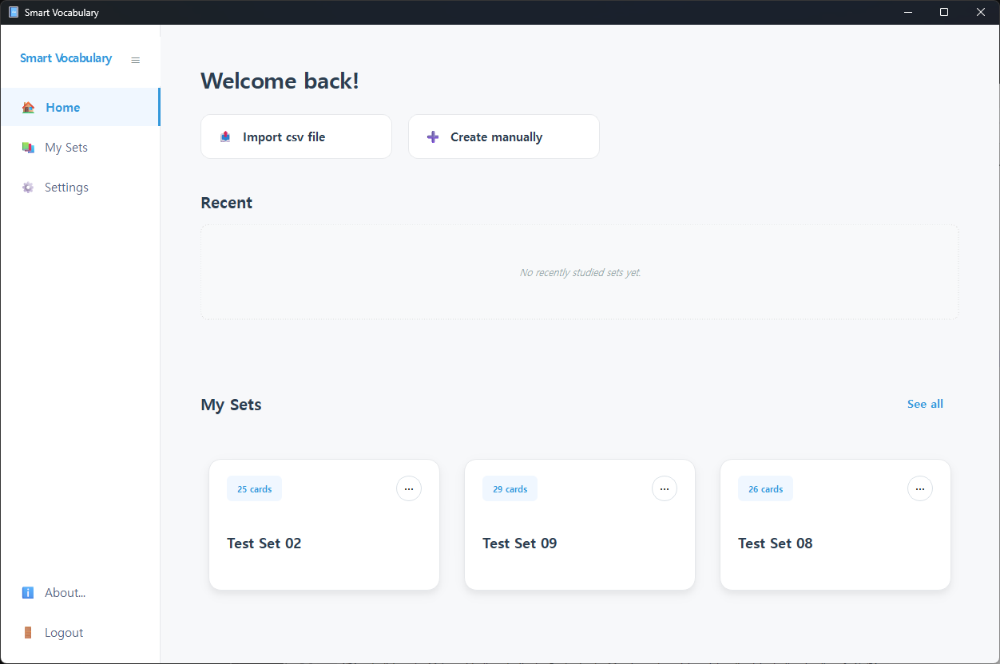
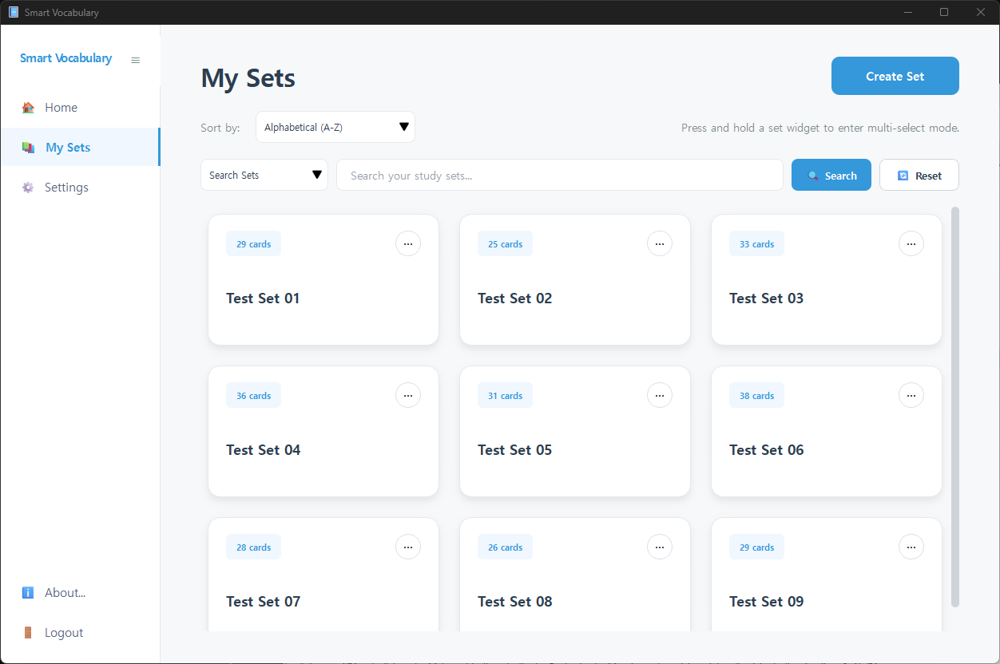
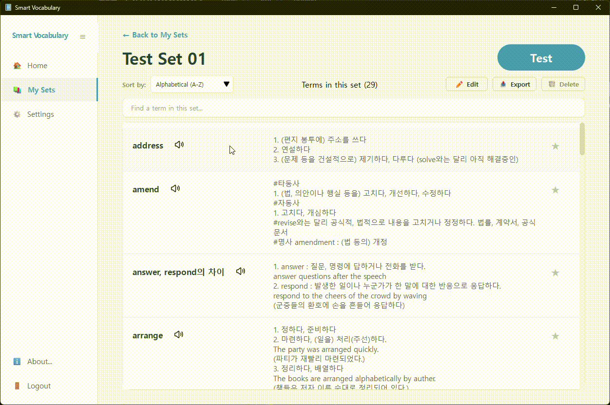
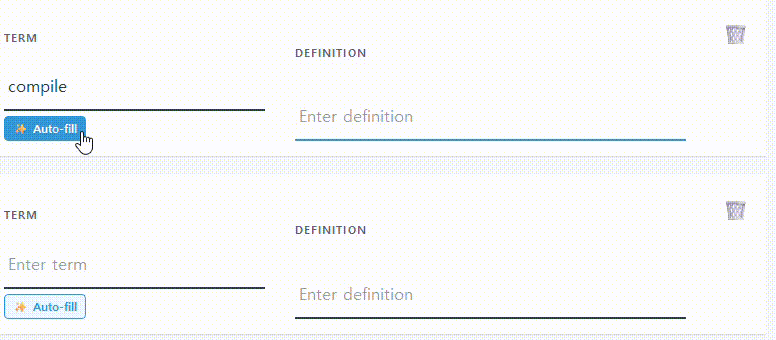
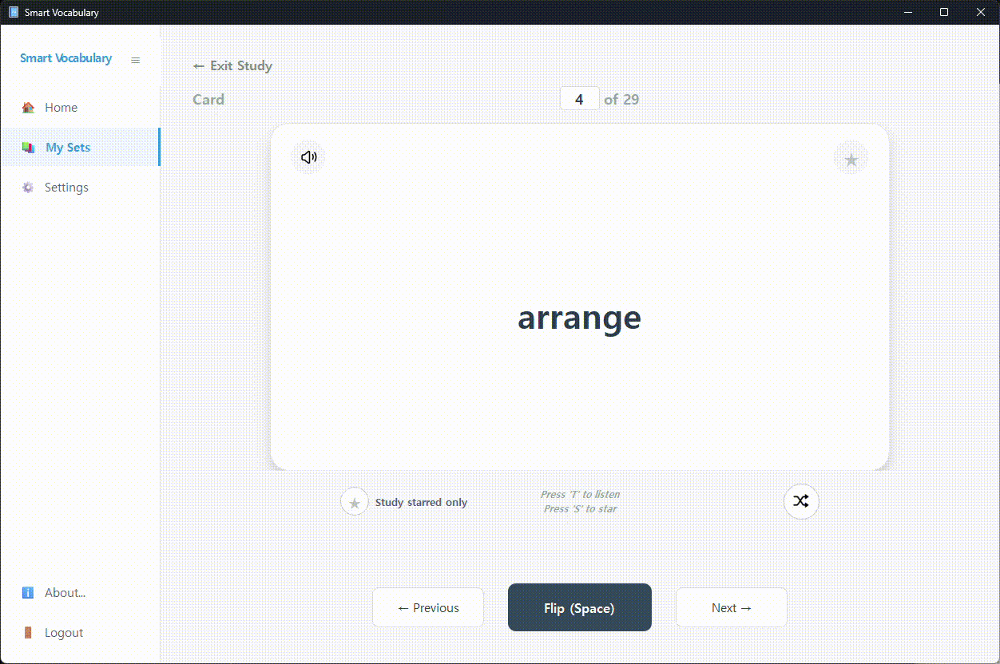

```markdown
## Table of Contents
- [개요](#개요-overview)
- [핵심 기능](#핵심-기능)
- [기술 스택](#tech-stack)
- [빌드 가이드](#smart-vocabulary-빌드-가이드)
- [패키징 가이드](#smart-vocabulary-패키징-가이드-pyinstaller)
- [보안 및 주의사항](#주의사항)
- [자신만의 Supabase 구축하기](#자신만의-supabase-구축하기)
```

# 개요 (Overview)

Smart Vocabulary는 현대적인 데스크탑 환경에서 AI 기술과 클라우드 동기화를 결합하여 사용자의 효율적인 외국어 학습을 돕는 스마트 영단어 암기장 애플리케이션입니다. 미리 구축된 supabase DB 또는 자신만의 supabase DB를 구축하여 회원가입 후 사용할 수 있습니다.  

실행 파일 다운로드 : Github의 Release 탭 또는 아래 링크(OneDrive)에서 바로 다운로드  
<a href="https://1drv.ms/u/c/6f9015af5fd64464/IQCUX7pgMgGlR7fi016vz-ewAR1l5r04DvdBH-0T28Be_KY?e=jsDjLO" target="_blank" rel="noopener noreferrer">우클릭을 눌러 새 창에서 다운로드하실 수 있습니다.</a>

  

<br>

빠른 테스트를 위해 테스트용 계정을 제공합니다.  
테스트 환경에서는 신규회원 가입을 할 수 없습니다.  
email: voca.user65@gmail.com  
password: test123$

이 계정은 공유되는 계정이며 회원탈퇴, 비밀번호 변경이 불가능합니다. 또한 테스트용으로 저장된 단어 카드 데이터도 변경/삭제할 수 없습니다. 테스트 유저는 자신이 새로 생성한 단어 데이터만 변경/삭제가 가능합니다.  

docs 폴더에서 이 포트폴리오의 상세 설명서와 PRD를 확인하실 수 있습니다.  

# 핵심 기능
### 1. 사용자 인증 및 프로필 (Auth & Profile)

* 회원가입/로그인: Supabase Auth를 통한 이메일 기반 OTP 인증.  
* 계정 관리: 비밀번호 변경 및 계정 삭제(회원 탈퇴) 기능.  
* 데이터 격리: 개별 사용자의 데이터는 RLS(Row Level Security)를 통해 철저히 보호.

### 2. 단어장(세트) 관리 (Set Management)
  

* 세트 생성/수정/삭제: 제목과 설명을 포함한 단어장 세트 관리.  
* CSV Import/Export: 대량의 단어 데이터를 파일 형태로 가져오거나 내보내기 지원.  
* 일괄 관리: 여러 세트를 선택하여 한 번에 내보내거나 삭제하는 Bulk Action 지원.  
  

### 3. 단어 카드 입력 및 AI 자동 완성 (Card Entry & AI Auto-fill)  
* 스마트 입력: 반응형 텍스트 박스를 통한 편리한 단어 입력.  
* ✨ AI Auto-fill: Google Gemini AI를 호출하여 단어의 뜻, 예문, 발음기호 등의 단어 상세정보를 자동으로 생성.  



### 4. 학습 모드 (Study Mode)
  

* 플래시 카드: 앞면(단어)과 뒷면(뜻)을 뒤집으며 학습하는 고전적인 방식.  
* TTS(Text-to-Speech): gTTS를 활용한 영어 발음 듣기 지원.  
* 별표(Starred) 기능: 중요 단어 표시 및 필터링.  
* 랜덤 셔플: 단어 순서를 섞어서 암기 효과 극대화.  
* 진도 추적: 최근 학습 시간 업데이트 및 기록.  

### 5. 설정 및 커스터마이징 (Settings)
* Gemini 모델 선택: 사용자가 원하는 AI 모델 설정.  
* 단어 상세정보를 자동으로 생성하는 프롬프트의 커스터마이징 지원.  
* 단축키 설정: 발음 듣기, 별표 표시 등 주요 기능에 대한 커스텀 단축키 지정.  
* 정렬 옵션: 세트 및 단어 리스트의 정렬 기준 설정.  

### Tech Stack
- **Language:** Python 3.13.13
- **UI Framework:** PySide6 (Qt for Python)
- **Backend/Database:** Supabase (PostgreSQL)
- **AI Integration:** Google Gemini API (Generative AI)
- **Voice:** gTTS (Google Text-to-Speech)
- **Packaging:** PyInstaller  
<br>

# 주의사항

Smart Vocabulary에서 영단어를 입력하면 단어 뜻, 예문, 발음기호 등을 자동으로 생성해주는 Auto-fill 기능을 사용하려면 Google AI Studio에서 발급받은 API Key가 필요합니다. 환경설정 화면에서 API KEY를 입력하는 방법을 선택할 수 있습니다.

1. 개인용 컴퓨터에서 실행할 경우 환경변수에서 읽어옵니다.  
2. 공용 컴퓨터에서 실행할 경우 사용자에게 1회용으로 API KEY를 입력받습니다.  

어떤 것을 선택하든 이 프로그램은 입력받은 API Key를 프로그램 메모리 내에서만 사용하며 외부로 전송하지 않습니다. 악의적인 제3자가 본 코드를 변조하여 배포하는 사칭 버전에 주의하시기 바라며, 반드시 본 공식 GitHub 저장소의 소스 코드를 직접 실행하거나 공식 배포하는 실행 파일의 SHA256 해시값을 확인하여 무결성을 검증하세요.

**해시값 검증 방법**  
  ```bash
  Get-FileHash ./bin/SmartVocabulary.exe -Algorithm SHA256
  ```  
위 결과로 나온 SHA256 값이 bin/SmartVocabulary.sha256의 내용과 동일해야 합니다.  
<br>

# SmartVocabulary 빌드 가이드 

1. Repository 클론
   ```bash
   git clone https://github.com/husti519/SmartVocabulary.git
   cd SmartVocabulary
   ```
2. 가상환경 구축 및 라이브러리 설치
   ```bash
   python -m venv .venv
   .venv\Scripts\activate
   pip install -r requirements.txt
   ```
3. 프로그램 실행
   ```bash
   python main.py
   ```  
<br>

# SmartVocabulary 패키징 가이드 (pyinstaller)

1. 먼저 패키징 설정 파일인 spec 파일을 다음 명령어로 생성할 수 있습니다.  
(프로젝트에는 이미 "SmartVocabulary.spec" 파일이 포함되어 있습니다.)  
    ```bash
    pyi-makespec --onefile --windowed --name=SmartVocabulary main.py
    ```
2. 생성된 SmartVocabulary.spec 파일을 편집하여 datas 경로에 리소스 폴더 경로(assets)를 
지정하거나 아이콘 파일의 경로를 추가할 수 있습니다.

3. 다음 명령어로 패키징하면 결과물이 dist 폴더에 생성됩니다.
    ```bash
    pyinstaller SmartVocabulary.spec
    ```
4. pyinstaller로 패키징된 프로그램을 실행하면 작업관리자의 프로세스 상세정보 탭에서 같은 
이름의 프로그램이 2개 실행된 것으로 보입니다. 메인 프로세스가 사용할 라이브러리 
파일들을 임시 폴더에 풀어놓는 부트스트래퍼 프로세스가 하나 더 실행되기 때문입니다.
이것은 pyinstaller로 패키징된 프로그램의 특성으로 정상적인 현상입니다.  
<br>
# 자신만의 Supabase 구축하기

자신만의 supabase 저장소를 구축하려면 docs 폴더에서 "나만의 Supabase 저장소 생성" 문서를 참조하세요.  
